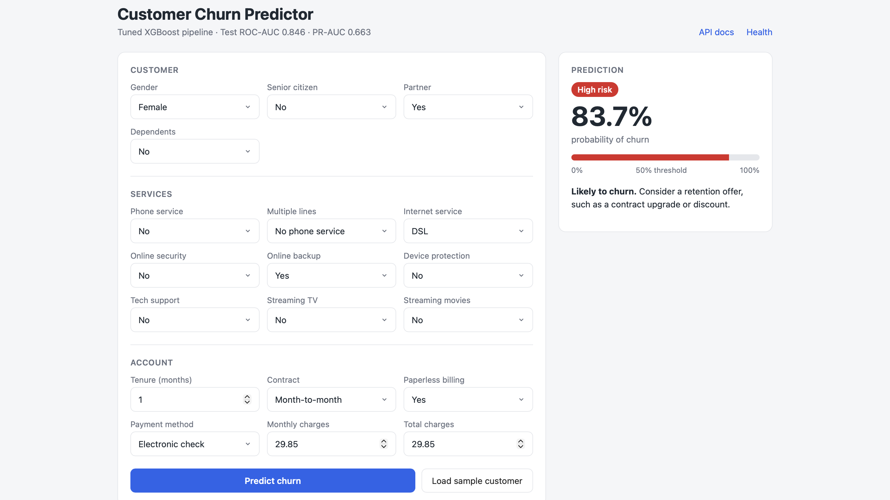
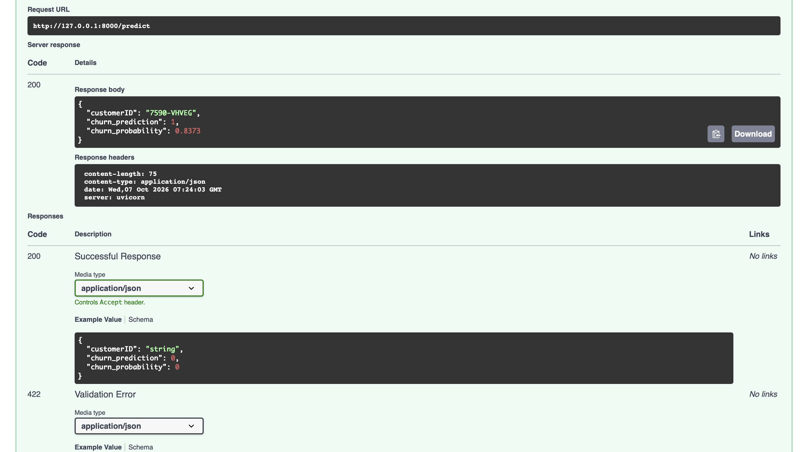
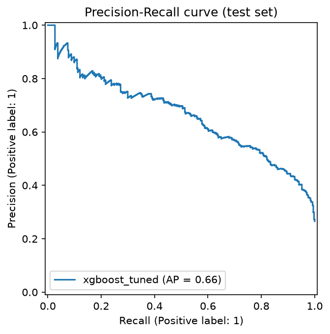

# Telco Customer Churn – ML Pipeline & Inference API

An end-to-end churn prediction pipeline built on the [Kaggle Telco Customer Churn dataset](https://www.kaggle.com/datasets/blastchar/telco-customer-churn): EDA, a leakage-safe scikit-learn pipeline, model comparison with cross-validation, a tuned XGBoost model, and a FastAPI service with a simple web UI that scores a single raw customer profile.



---

## Project structure

```
telco-churn-mle/
├── app/
│   ├── main.py              # FastAPI app with Pydantic input validation
│   └── static/index.html    # lightweight web UI (plain HTML + JS)
├── src/
│   ├── config.py            # paths, column lists, random seed
│   ├── data.py              # deterministic cleaning (shared by training and inference)
│   ├── pipeline.py          # ColumnTransformer + model in one sklearn Pipeline
│   ├── train.py             # CV comparison, tuning, evaluation, model export
│   └── predict.py           # loads the pipeline and scores a raw JSON payload
├── notebooks/01_eda.ipynb   # exploratory analysis and findings
├── models/churn_pipeline.joblib
├── reports/                 # metrics.json, PR curve, screenshots
├── tests/test_predict.py    # inference + API tests
├── sample_input.json
└── requirements.txt
```

---

## Setup

Tested on macOS with Python 3.13.

```bash
git clone https://github.com/jaydugad/telco-churn-mle.git
cd telco-churn-mle
python3 -m venv .venv
source .venv/bin/activate
pip install -r requirements.txt
```

Download the dataset from Kaggle and save it as `data/telco_churn.csv`.

> **macOS note:** XGBoost needs the OpenMP runtime. If importing it fails, run `brew install libomp`.

---

## How to run

**1. Train the model** (about 1–3 minutes). This saves the pipeline, metrics and PR curve.
```bash
python -m src.train
```

**2. Predict from the command line**
```bash
python -m src.predict sample_input.json
```

**3. Run the API and web UI**
```bash
uvicorn app.main:app --reload
```
- Web UI: http://127.0.0.1:8000
- Interactive API docs: http://127.0.0.1:8000/docs

```bash
curl -X POST http://127.0.0.1:8000/predict \
  -H "Content-Type: application/json" \
  -d @sample_input.json
```

Response:
```json
{
  "customerID": "7590-VHVEG",
  "churn_prediction": 1,
  "churn_probability": 0.8373
}
```



**4. Run the tests**
```bash
python -m pytest -v
```
The four tests cover the prediction function, the `/predict` endpoint, rejection of invalid numeric input, and rejection of unknown category values.

---

## Approach

### EDA findings
- **About 26.5% of customers churn**, so the target is imbalanced.
- **`TotalCharges` is stored as text** and has 11 blank values. All 11 belong to customers with `tenure = 0`: new customers who haven't been billed yet.
- **Contract type is the strongest signal:** month-to-month customers churn at about 43%, compared with 11% on one-year and under 3% on two-year contracts.
- **Churn is concentrated in the first few months** of tenure and is rare among long-standing customers.
- **Churners pay more per month** (median around 80 vs about 65 for customers who stayed).

### Preprocessing and leakage prevention
- **Fixed rules live in `data.py`:** converting `TotalCharges` to numeric, filling the tenure-0 blanks with **0** (a domain rule, since these customers have genuinely paid nothing, rather than a learned value), treating `SeniorCitizen` as categorical, and dropping `customerID`.
- **Learned steps live inside the sklearn `Pipeline`:** median/mode imputation as a safety net, scaling, and one-hot encoding. This means they're fitted only on training folds during cross-validation.
- **The test set (20%, stratified) is split off first** and used exactly once, for final evaluation.
- **Training and inference share `clean_features()`,** so raw JSON is cleaned the same way as the training data.

### Class imbalance
- `class_weight="balanced"` for Logistic Regression and Random Forest
- `scale_pos_weight ≈ 2.77` (negatives ÷ positives) for XGBoost
- Stratified splits and `StratifiedKFold(5)` throughout

### Model selection
I compared three models with 5-fold stratified CV on the training set, then tuned XGBoost with `RandomizedSearchCV` (25 iterations, PR-AUC scoring) on the **full pipeline**. The final model was chosen by **CV score, not test score**, to avoid leaking test information into model selection.

---

## Results

| Model | CV PR-AUC |
|---|---|
| Logistic Regression (baseline) | 0.660 |
| Random Forest | 0.654 |
| XGBoost | 0.665 |
| **XGBoost (tuned)** | **0.670** |

**Held-out test set (tuned XGBoost):**

| ROC-AUC | PR-AUC | F1 | Precision | Recall | Accuracy |
|---|---|---|---|---|---|
| 0.846 | 0.663 | 0.632 | 0.522 | 0.802 | 0.752 |



Full metrics for every model are in `reports/metrics.json`.

**Observations:**
- **Logistic Regression is within about 0.01 PR-AUC of tuned XGBoost.** The signal is largely captured by a few strong features (contract, tenure, charges), so the simpler, more interpretable model would be a reasonable production choice if explainability matters more than the small gain.
- **The model catches about 80% of churners (recall 0.80) at a precision of 0.52.** For churn, that trade-off is usually right: a retention offer to a customer who wasn't going to leave costs far less than losing one who was.

### Why accuracy isn't enough
With about 73% of customers not churning, a model that always predicts "No churn" scores around **73% accuracy while catching zero churners**. Accuracy rewards the majority class and hides exactly the errors we care about. I used **PR-AUC** as the primary metric because it focuses on the minority class and is threshold-independent, alongside recall and F1 at the chosen threshold.

---

## Design decisions
- **One serialized pipeline** (`joblib`) bundles preprocessing and the model, so the API accepts raw JSON with no separate transformation step.
- **Pydantic validation** returns a 422 for malformed input, such as negative tenure.
- **Category values are validated** with `Literal` types, so unknown values (for example, `"Contract": "Weekly"`) are rejected with a 422 instead of being silently encoded.
- **A lightweight web UI** (plain HTML and JavaScript, with no build step) lets non-technical users try the model in a browser.
- **The model is loaded once** and cached with `lru_cache` instead of being reloaded on every request.
- **Configuration is centralised** in `config.py`, and the random seed is fixed for reproducibility.

---

## If I had 2 more days

1. **Containerisation and CI/CD:** a Dockerfile for the API, plus a GitHub Actions workflow that runs linting, tests and a training smoke test on every push, so the service is reproducible and deployable anywhere.
2. **Experiment tracking and model versioning:** MLflow to log runs, parameters and metrics, with a model registry for versioned, promotable models. I'd also tune the decision threshold against a business cost (the value of a saved customer vs the cost of a retention offer) instead of using 0.5.
3. **Production monitoring and explainability:** input and prediction drift monitoring (for example, Evidently), logging predictions for later evaluation against real outcomes, and SHAP-based explanations with each prediction so retention teams know *why* a customer is flagged.